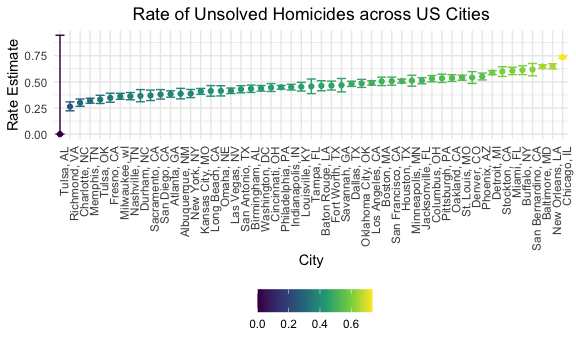
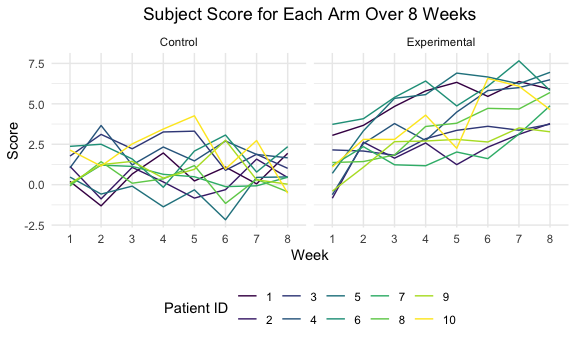

P8105 HW5 jl6046
================
Brian Jo Hsuan Lee
2021-11-15

Load packages

``` r
library(tidyverse)
setwd("~/Desktop/Columbia/Fall_2021/P8105-Data_Science/HW/p8105_hw5_jl6046/")
```

Set knitr options

``` r
knitr::opts_chunk$set(
  fig.width = 6,
  fig.asp = .6,
  out.width = "90%"
)

theme_set(theme_minimal() + theme(legend.position = "bottom"))

options(
  ggplot2.continuous.colour = "viridis",
  ggplot2.continuous.fill = "viridis"
)

scale_colour_discrete = scale_colour_viridis_d
scale_fill_discrete = scale_fill_viridis_d
```

## Problem 1

Import and tidy the homicide dataset

``` r
hom_df = 
  read_csv("./data_files/homicide-data.csv", col_types = "cdccfdfffddf") %>% 
  unite(city_state, city, state, sep = ", ") %>% 
  mutate(
    city_state = factor(city_state),
    year = str_extract(reported_date, "^\\d{4}"),
    year = as.factor(year),
    month = str_extract(reported_date, "(?<=^....)\\d{2}"),
    month = month.name[as.numeric(month)],
    month = factor(month, levels = month.name[]),
    day = str_extract(reported_date, "\\d{2}$"),
    day = as.numeric(day)
  ) %>% 
  select(
    uid, year, month, day, everything(), -reported_date
  )
```

Create a table for total and unresolved homicides

``` r
hom_sum_df = 
  hom_df %>% 
  group_by(city_state) %>% 
  summarize(tot_hom = n(),
            unsol_hom = sum(disposition != "Closed by arrest")) %>% 
  arrange(desc(tot_hom), desc(unsol_hom))

knitr::kable(
  hom_sum_df,
  format = "simple"
)
```

| city\_state        | tot\_hom | unsol\_hom |
|:-------------------|---------:|-----------:|
| Chicago, IL        |     5535 |       4073 |
| Philadelphia, PA   |     3037 |       1360 |
| Houston, TX        |     2942 |       1493 |
| Baltimore, MD      |     2827 |       1825 |
| Detroit, MI        |     2519 |       1482 |
| Los Angeles, CA    |     2257 |       1106 |
| St. Louis, MO      |     1677 |        905 |
| Dallas, TX         |     1567 |        754 |
| Memphis, TN        |     1514 |        483 |
| New Orleans, LA    |     1434 |        930 |
| Las Vegas, NV      |     1381 |        572 |
| Washington, DC     |     1345 |        589 |
| Indianapolis, IN   |     1322 |        594 |
| Kansas City, MO    |     1190 |        486 |
| Jacksonville, FL   |     1168 |        597 |
| Milwaukee, wI      |     1115 |        403 |
| Columbus, OH       |     1084 |        575 |
| Atlanta, GA        |      973 |        373 |
| Oakland, CA        |      947 |        508 |
| Phoenix, AZ        |      914 |        504 |
| San Antonio, TX    |      833 |        357 |
| Birmingham, AL     |      800 |        347 |
| Nashville, TN      |      767 |        278 |
| Miami, FL          |      744 |        450 |
| Cincinnati, OH     |      694 |        309 |
| Charlotte, NC      |      687 |        206 |
| Oklahoma City, OK  |      672 |        326 |
| San Francisco, CA  |      663 |        336 |
| Pittsburgh, PA     |      631 |        337 |
| New York, NY       |      627 |        243 |
| Boston, MA         |      614 |        310 |
| Tulsa, OK          |      583 |        193 |
| Louisville, KY     |      576 |        261 |
| Fort Worth, TX     |      549 |        255 |
| Buffalo, NY        |      521 |        319 |
| Fresno, CA         |      487 |        169 |
| San Diego, CA      |      461 |        175 |
| Stockton, CA       |      444 |        266 |
| Richmond, VA       |      429 |        113 |
| Baton Rouge, LA    |      424 |        196 |
| Omaha, NE          |      409 |        169 |
| Long Beach, CA     |      378 |        156 |
| Albuquerque, NM    |      378 |        146 |
| Sacramento, CA     |      376 |        139 |
| Minneapolis, MN    |      366 |        187 |
| Denver, CO         |      312 |        169 |
| Durham, NC         |      276 |        101 |
| San Bernardino, CA |      275 |        170 |
| Savannah, GA       |      246 |        115 |
| Tampa, FL          |      208 |         95 |
| Tulsa, AL          |        1 |          0 |

Compute the proportion of unresolved homicides in Baltimore

``` r
balt_hom_sum_df =
  hom_sum_df %>% 
  filter(city_state == "Baltimore, MD")

balt_test = 
  prop.test(pull(balt_hom_sum_df, unsol_hom), pull(balt_hom_sum_df, tot_hom)) %>% 
  broom::tidy()

knitr::kable(
  balt_test,
  format = "simple"
)
```

|  estimate | statistic | p.value | parameter |  conf.low | conf.high | method                                               | alternative |
|----------:|----------:|--------:|----------:|----------:|----------:|:-----------------------------------------------------|:------------|
| 0.6455607 |   239.011 |       0 |         1 | 0.6275625 | 0.6631599 | 1-sample proportions test with continuity correction | two.sided   |

Compute the proportion for all cities

``` r
city_prop_function = function(city){
  city_hom_sum_df =
    hom_sum_df %>% 
    filter(city_state == city)

  test = 
    prop.test(pull(city_hom_sum_df, unsol_hom), pull(city_hom_sum_df, tot_hom)) %>% 
    broom::tidy()
  
  return(test)
}

hom_test_df = 
  hom_sum_df %>% 
  mutate(
    test_res = map(city_state, city_prop_function)
  ) %>% 
  unnest(test_res) %>% 
  select(city_state, estimate, starts_with("conf"))
```

Graph data using a scatter plot with error bars

``` r
hom_test_df %>% 
   mutate(
     city_state = fct_reorder(city_state, estimate)
   ) %>% 
  ggplot(aes(x = city_state, y = estimate, color = estimate))+
  geom_point()+
  geom_errorbar(aes(ymin = conf.low, ymax = conf.high)) +
  labs(
    title = "Rate of Unsolved Homicides across US Cities",
    x = "City",
    y = "Rate Estimate"
  ) +
  theme(
    plot.title = element_text(hjust = 0.5),
    axis.text.x = element_text(angle = 90, hjust = 1),
    legend.title = element_blank()
  )
```



## Problem 2

Load and tidy the arm score datasets.

``` r
setwd("./data_files/data/")

long_df = 
  tibble(
    file_name = list.files(".")
  ) %>% 
  mutate(
    content = map(file_name, read_csv)
  ) %>% 
  unnest(content) %>% 
  separate(file_name, into = c("group", "id"), sep = "_") %>% 
  mutate(
    group = factor(group, levels = c("con", "exp"), labels = c("Control", "Experimental")),
    id = str_replace(id, ".csv", ""),
    id = factor(as.numeric(id))
  ) %>% 
  pivot_longer(
    week_1:week_8,
    names_to = "week",
    names_prefix = "week_",
    values_to = "measurement"
  ) 
```

Plot a spaghetti graph to show the 2 arm scores over time for each of
the 10 subjects. The experimental group showed a general trend of
increasing scores, whereas the control group does not.

``` r
long_df %>% 
  ggplot(aes(x = week, y = measurement)) +
  geom_line(aes(group = id, color = id)) +
  facet_grid(cols = vars(group)) +
  labs(
    title = "Subject Score for Each Arm Over 8 Weeks",
    x = "Week",
    y = "Score",
    color = "Patient ID"
  ) +
  theme(
    plot.title = element_text(hjust = 0.5),
  )
```


